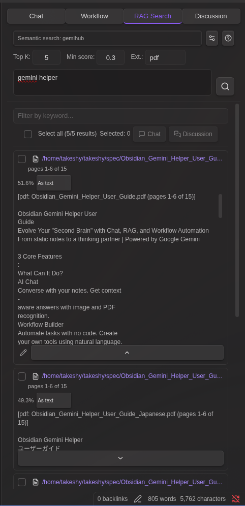
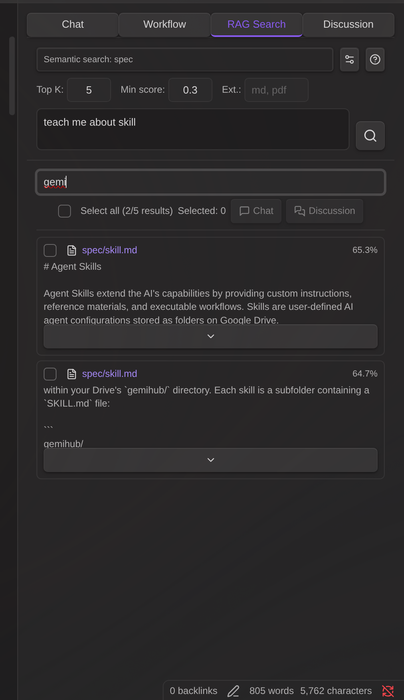
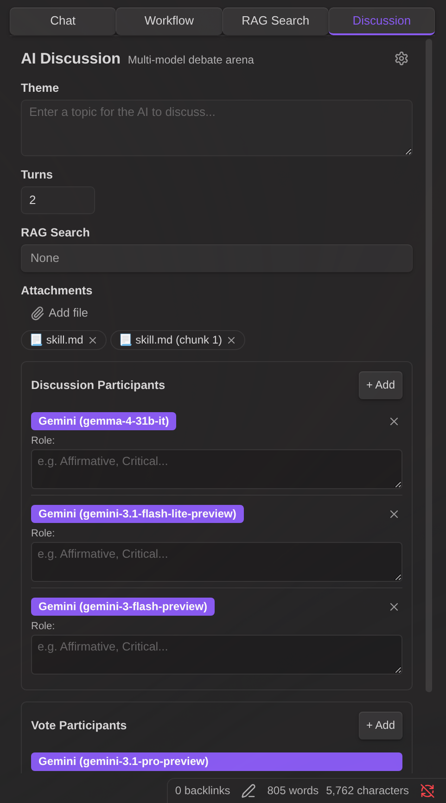
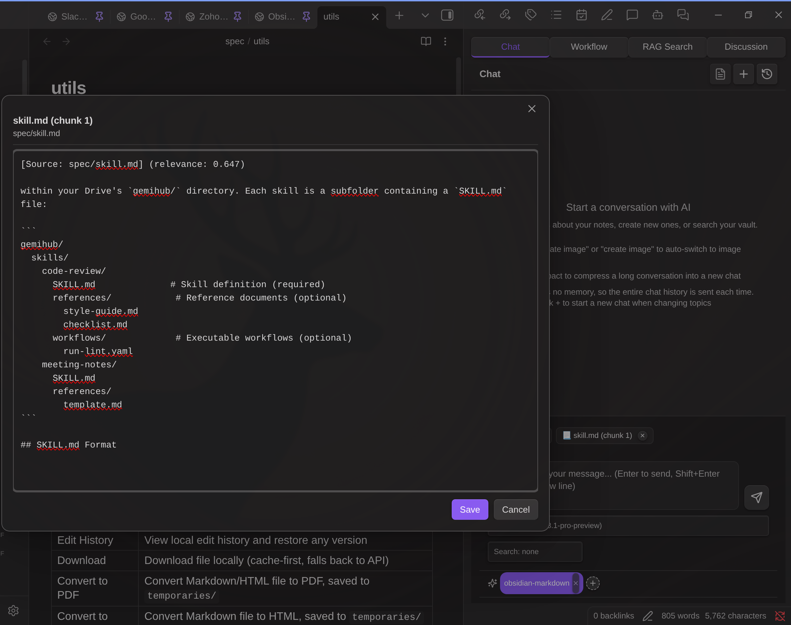
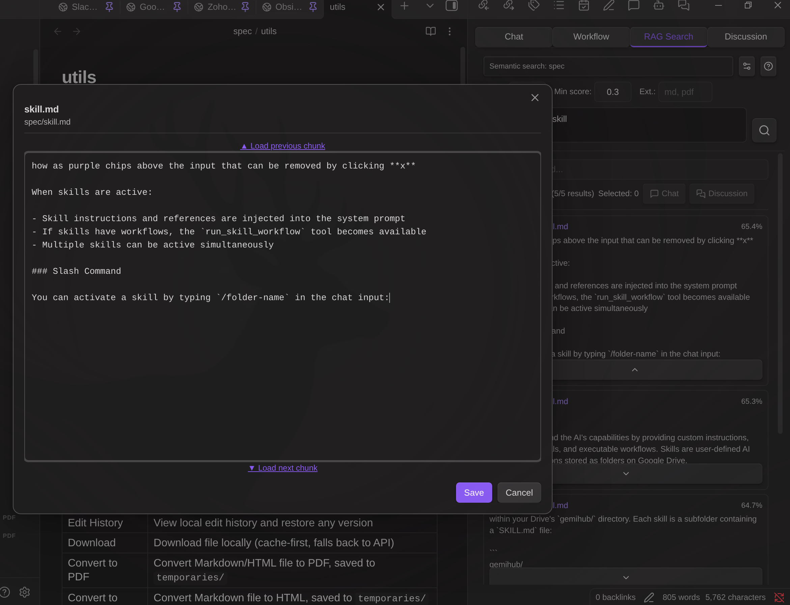

# RAG 搜索

**RAG 搜索**选项卡提供了一个专用界面，用于语义向量搜索、关键词过滤、分块编辑，以及将结果发送到 Chat 或 Discussion。

## 搜索

1. 从下拉菜单中选择一个 **RAG 设置**（每个设置有自己的索引、embedding 模型和参数）
2. 输入查询内容后按 Enter 或点击搜索按钮
3. 根据需要调整 **Top K**（最大结果数）和 **Score Threshold**（最低相似度）

结果按查询 embedding 与各索引分块之间的余弦相似度排序。

## 关键词过滤

语义搜索完成后，使用结果列表顶部的关键词过滤输入框，按关键词缩小结果范围。

- 以空格分隔的多个词条——所有词条都必须匹配（AND 逻辑）
- 同时匹配分块文本和文件路径
- "全选"复选框和计数反映的是过滤后的视图
- 清除过滤条件可查看全部结果

## 选择结果

- 点击结果行可切换其选中状态
- 使用**全选**复选框可选中/取消选中所有可见（过滤后的）结果
- **已选**计数显示的是所有结果中被选中的数量（不仅仅是过滤后的视图）

## 将结果发送到 Chat 或 Discussion

勾选结果后，点击相应按钮：

- **Chat** — 结果将作为附件添加到 Chat 输入区域。Chat 的 RAG 下拉菜单会自动设置为"none"，以避免重复注入上下文。
- **Discussion** — 结果将作为附件添加到 Discussion 面板，并自动切换到 Discussion 选项卡。

文本结果会变为可编辑的文本附件。媒体结果（图片、PDF、音频、视频）则作为二进制文件附加。

**Chat中编辑：** 将结果发送到Chat后，带有源路径的文本附件在输入区域中可点击。点击后会打开模态框，可以在发送前查看和编辑内容。

## 编辑分块

点击铅笔图标（展开文本结果时可见）可打开分块编辑器弹窗。

在编辑器中你可以：

- **编辑文本** — 自由修改分块内容。修改会保存回搜索结果列表。
- **加载上一个分块** — 点击 `▲ Load previous chunk` 可在前面添加同一文件中的上一个分块。分块之间的重叠部分会自动移除。
- **加载下一个分块** — 点击 `▼ Load next chunk` 可在后面添加同一文件中的下一个分块。重叠部分会自动移除。
- **合并编辑** — 加载相邻分块后，所有文本可作为一个整体进行编辑。保存后更新结果。

当语义搜索返回的分块缺少周围文本的重要上下文时，此功能非常有用。

## PDF 结果处理

- **内部 RAG**（由本插件索引）：PDF 以提取的页面分块形式附加
- **外部 RAG**（预构建索引，包含提取的文本）：每个结果有下拉菜单可选择：
  - **作为文本** — 从 PDF 提取的可编辑文本
  - **作为 PDF 分块** — 带内联预览的原始 PDF 页面

## 索引设置

点击搜索栏中的齿轮图标可打开内联索引配置：

- **Chunk Size** — 每个分块的字符数
- **Chunk Overlap** — 相邻分块之间的字符重叠量
- **PDF Chunk Pages** — 每个 embedding 分块包含的 PDF 页数（1–6）
- **Target Folders** — 将索引限制在指定文件夹内（逗号分隔）
- **Exclude Patterns** — 用于排除文件的正则表达式模式（每行一个）
- **Search File Extensions** — 将搜索限制为指定的文件类型（逗号分隔）
- **Sync** 按钮，带有进度条和上次同步的时间戳
- **已索引文件**列表，显示每个文件的分块数量

## Chat 中的 RAG 与搜索中的 RAG 对比

| | Chat + RAG 下拉菜单 | 搜索 → 选择 → Chat/Discussion |
|---|---|---|
| **上下文注入** | 系统提示词（自动） | 用户消息附件 |
| **编辑** | 发送前不可编辑 | 点击附件可在弹窗中编辑 |
| **参数** | 使用 RAG 设置的默认值 | 每次搜索可调整（Top K、阈值） |
| **结果选择** | 自动包含所有结果 | 用户选择要包含的结果 |
| **相邻分块** | 不可用 | 可在编辑器中加载上一个/下一个分块 |
| **关键词过滤** | 不可用 | 选择前可过滤结果 |

搜索流程让你对发送给 LLM 的上下文有更精细的控制。Chat 的 RAG 下拉菜单则是全自动上下文注入的便捷方式。

## Discussion 中的 RAG

Discussion 面板通过两种方式支持 RAG：

1. **搜索 → Discussion** — 在搜索选项卡中选择结果并点击 Discussion 按钮。结果会作为附件添加，开始前可以编辑。
2. **RAG 下拉菜单** — 在 Discussion 面板中直接选择 RAG 设置。主题文本将作为搜索查询使用。当已有附件（来自搜索或文件上传）时此选项不可用。

RAG 上下文和附件仅在讨论的**第一轮**发送，以避免冗余的 API 调用。后续轮次基于已经包含 RAG 上下文的讨论历史记录进行。
